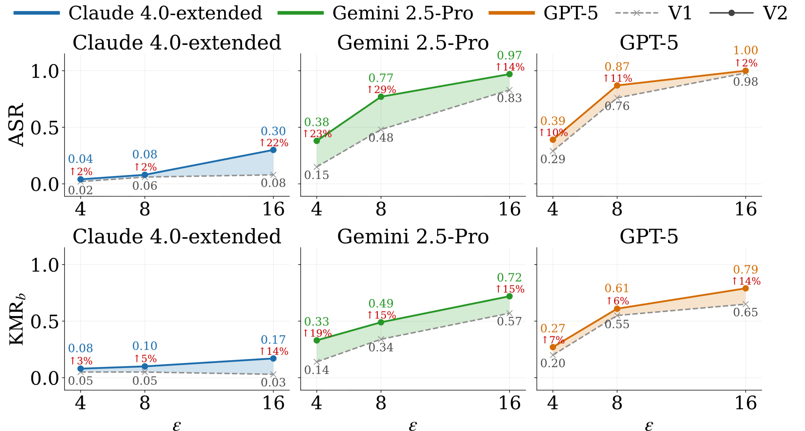
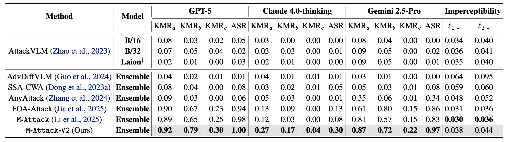
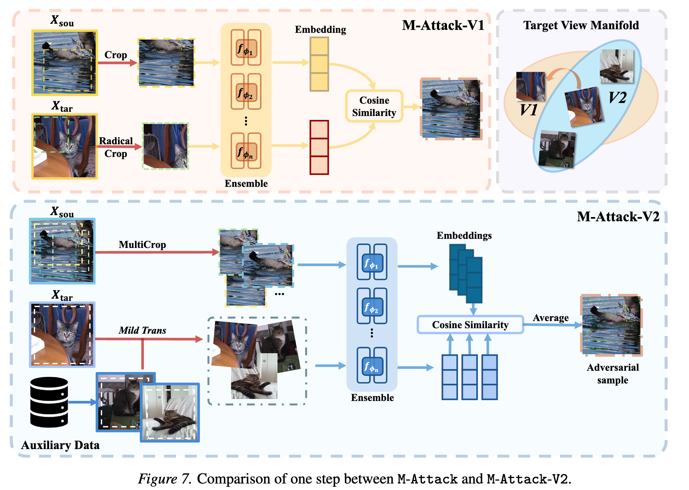
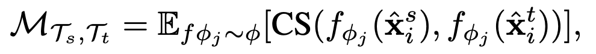
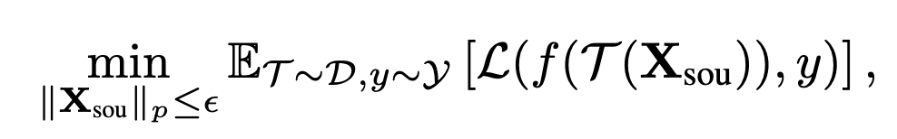

# M-Attack-V2

[](https://vila-lab.github.io/M-Attack-V2-Website/)
<a href="https://arxiv.org/abs/2503.10635"></a>
[](https://x.com/vila_shen_lab)
[](LICENSE)
[](https://www.python.org/downloads/release/python-3100/)
[](https://github.com/VILA-Lab/M-Attack-V2/issues)

Official implementation of **Pushing the Frontier of Black-Box LVLM Attacks via Fine-Grained Detail Targeting**.



> `M-Attack-V2` **substantially** improves [`M-Attack (v1)`](https://github.com/VILA-Lab/M-Attack) by reducing unstable local-gradient behavior and handling source-target asymmetry more explicitly.

## Quick Start

1. Install dependencies

```bash
uv sync
uv run python -m spacy download en_core_web_sm
```

2. Add API keys in `api_keys.yaml`

```yaml
gpt4o:
  - "your_openai_key"
claude:
  - "your_anthropic_key"
gemini:
  - "your_google_key"
# optional
gpt5:
  - "your_openai_key"
```

3. Run end-to-end pipeline

```bash
uv run bash run_parallel.sh
```

`run_parallel.sh` runs:

1. `generate_ad_sample_parallel.py`
2. `blackbox_text_generation.py`
3. `gpt_evaluate.py`
4. `keyword_matching_gpt.py`

## Required Data

Expected folders:

1. `resources/images/bigscale` or `resources/images/bigscale_100`
2. `resources/images/target_images` or `resources/images/target_images_100`
3. `resources/retrieved_embeddings`

`keyword_matching_gpt.py` expects `keywords.json` under `.../target_images/1/keywords.json`.
`resources/embeddings` is an optional retrieval cache and will be created automatically if you run `retrieval.py`.

## Advanced Docs

1. Retrieval pipeline: `docs/retrieval.md`
2. Hyperparameter template: `docs/hyperparameters.md`

## Notes

1. Configure `wandb.entity` in `config/ensemble_3models.yaml` if you use Weights & Biases.
2. Do not commit `api_keys.yaml`.
3. Hydra config entry point is `config/ensemble_3models.yaml`.

## Results and Method Details

### Main Result



### Main Algorithm



### Framework Reformulation (v1 vs Ours)

M-Attack (v1, [GitHub](https://github.com/VILA-Lab/M-Attack)):


Asymmetric matching (ours):


`MCA` (Multi-Crop Alignment) improves expectation estimation by averaging alignment over multiple local crops.
`ATA` (Auxiliary Target Alignment) improves target semantic sampling by using auxiliary target cues for a stabler reference.
